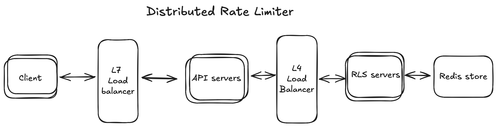

# distributed-rate-limiter

## Project Overview

This project is a ground-up implementation of a distributed rate limiter, a crucial component for protecting APIs and managing traffic in modern, scalable systems. It is built with Go using a high-performance, horizontally scalable microservices architecture.

### Key Features & Technical Highlights

- **Microservices Architecture**: The system is composed of distinct services: a protected `api-server`, the core `rls-server` (Rate Limiter Service), and Redis for distributed state management.
- **High-Performance Communication**: Services communicate efficiently using gRPC, with API contracts defined via Protocol Buffers for low-latency, strongly-typed interactions.
- **Scalability & High Availability**: Both the API and rate limiter services are designed to be scaled horizontally. NGINX is used for load balancing to distribute traffic evenly across service replicas, ensuring resilience and high availability.
- **Efficient Rate Limiting Algorithm**: It implements the **Sliding Window Log** algorithm using Redis Sorted Sets. This provides a precise and memory-efficient method for tracking request timestamps.
- **Atomic Redis Operations**: The core rate-limiting logic is encapsulated in a Lua script, which is executed atomically by Redis. This approach is highly performant as it minimizes network round-trips and prevents race conditions in a concurrent environment.
- **Containerized Deployment**: The entire application is containerized with Docker and orchestrated using Docker Compose, allowing for easy, reproducible deployments.

Distributed Rate Limiter built with Go for controlling API traffic across multiple nodes.



## To run this application:

### Run with Docker Compose

Environment files:

- Create a repo-level `.env`:

```bash
REDIS_HOST=redis
REDIS_PORT=6379
REDIS_PASSWORD=${REDIS_PASSWORD}
RATE_LIMITER_HOST=rls-server-lb
```

Start services (from repo root):

```bash
docker compose -f docker/docker-compose.yml --env-file .env up -d
```

Services:

- Redis (data source)
- rls-server (gRPC)
- api-server (protected resource)

Stop:

```bash
docker compose -f docker/docker-compose.yml down
```

Clean volumes (Redis data):

```bash
docker compose -f docker/docker-compose.yml down -v
```

### Rebuild after code changes

Rebuild only `rls-server`:

```bash
docker compose -f docker/docker-compose.yml build rls-server
docker compose -f docker/docker-compose.yml up -d
```

Rebuild everything:

```bash
docker compose -f docker/docker-compose.yml build
docker compose -f docker/docker-compose.yml up -d
```

### Run the test client

Create an external network test-net -> Run the test-client image

```bash
docker network create test-net
docker compose -f test-client/docker-compose.yml up -d
```
